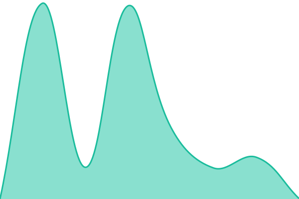
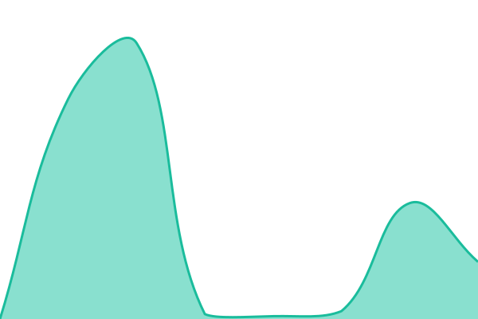
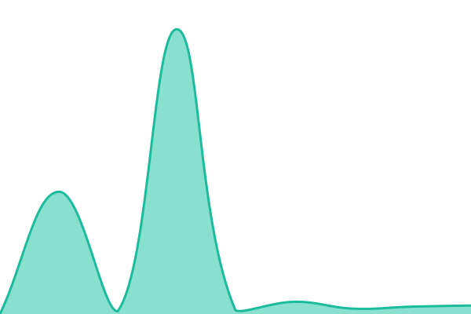

# [📈 Live Status](https://status.bitrot.cafe): <!--live status--> **🟥 Complete outage**

This repository contains the open-source uptime monitor and status page for [clay](https://uvclay.com), powered by [Upptime](https://github.com/upptime/upptime).

With [Upptime](https://upptime.js.org), you can get your own unlimited and free uptime monitor and status page, powered entirely by a GitHub repository. We use [Issues](https://github.com/UVClay/status/issues) as incident reports, [Actions](https://github.com/UVClay/status/actions) as uptime monitors, and [Pages](https://status.bitrot.cafe) for the status page.

<!--start: status pages-->
<!-- This summary is generated by Upptime (https://github.com/upptime/upptime) -->
<!-- Do not edit this manually, your changes will be overwritten -->
<!-- prettier-ignore -->
| URL | Status | History | Response Time | Uptime |
| --- | ------ | ------- | ------------- | ------ |
|  bitrot-dg (BUF 1) | 🟥 Down | [bitrot-dg-buf-1.yml](https://github.com/UVClay/status/commits/HEAD/history/bitrot-dg-buf-1.yml) | 

 6297ms
     
 | 

<a href="https://status.bitrot.cafe/history/bitrot-dg-buf-1">52.80%</a>
    

|  [Fluxer](https://chat.bitrot.cafe) | 🟥 Down | [fluxer.yml](https://github.com/UVClay/status/commits/HEAD/history/fluxer.yml) | 

 358ms
     
 | 

<a href="https://status.bitrot.cafe/history/fluxer">52.85%</a>
    

|  [Fluxer LiveKit (Video + Voice)](chat.bitrot.cafe) | 🟥 Down | [fluxer-live-kit-video-voice.yml](https://github.com/UVClay/status/commits/HEAD/history/fluxer-live-kit-video-voice.yml) | 

 43ms
     
 | 

<a href="https://status.bitrot.cafe/history/fluxer-live-kit-video-voice">52.89%</a>
    

|  [Gitrot](https://git.bitrot.cafe) | 🟥 Down | [gitrot.yml](https://github.com/UVClay/status/commits/HEAD/history/gitrot.yml) | 

 1858ms
     
 | 

<a href="https://status.bitrot.cafe/history/gitrot">52.90%</a>
    

|  [Homepage](https://bitrot.cafe) | 🟥 Down | [homepage.yml](https://github.com/UVClay/status/commits/HEAD/history/homepage.yml) | 

 1298ms
     
 | 

<a href="https://status.bitrot.cafe/history/homepage">52.90%</a>
    

<!--end: status pages-->

[**Visit our status website →**](https://status.bitrot.cafe)

## 📄 License

- Powered by: [Upptime](https://github.com/upptime/upptime)
- Code: [MIT](./LICENSE) © [Anand Chowdhary](https://anandchowdhary.com)
- Data in the `./history` directory: [Open Database License](https://opendatacommons.org/licenses/odbl/1-0/)
